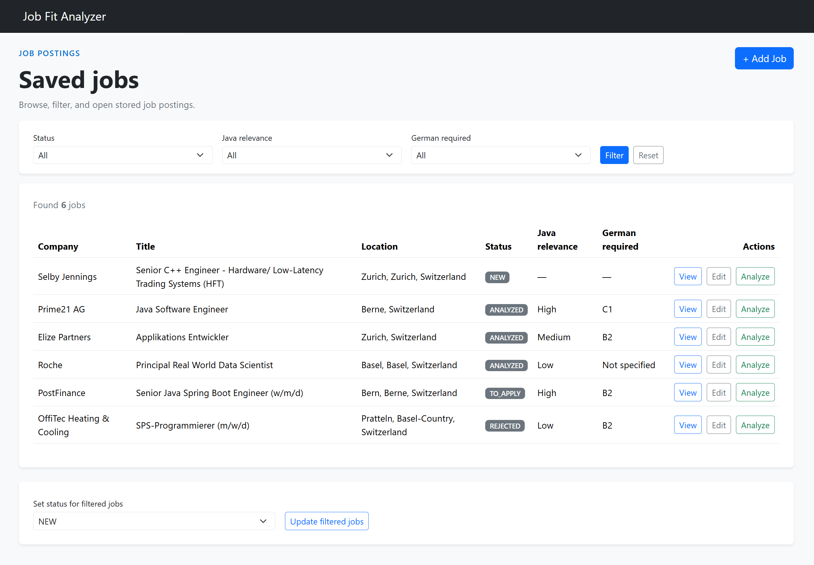
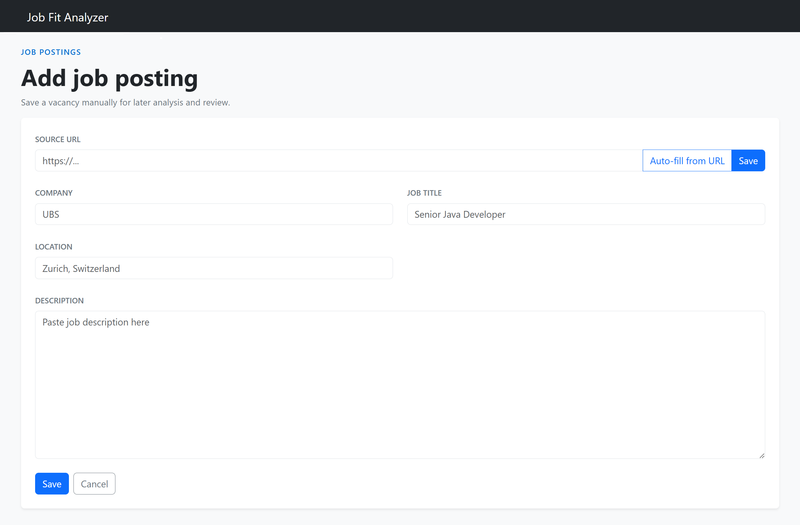
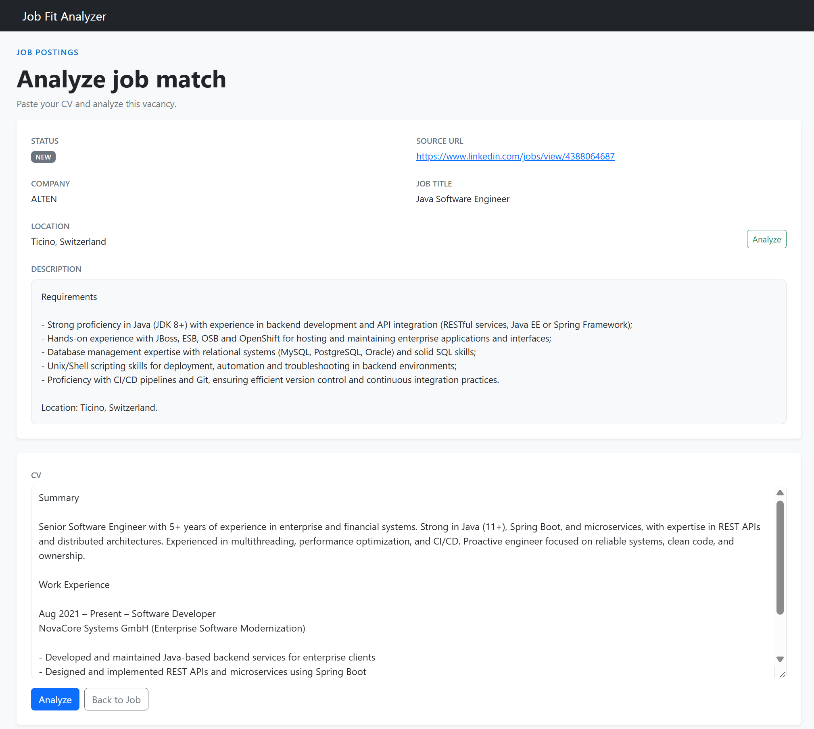
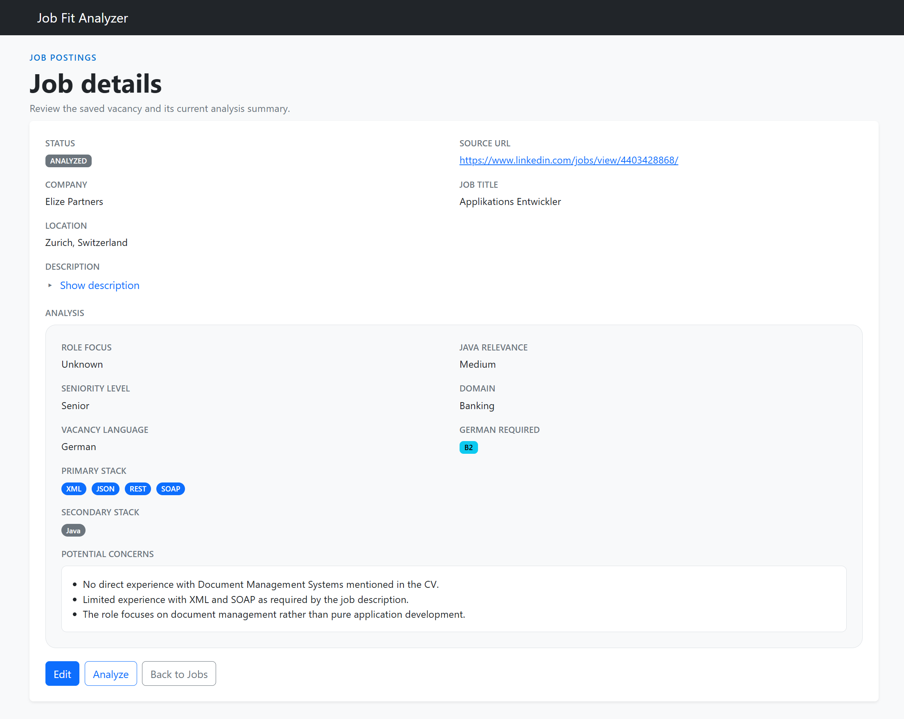

# Job Fit Analyzer

Job Fit Analyzer is an AI-powered job triage platform that helps job seekers systematically review and prioritize vacancies against a candidate profile. It uses LLM-based analysis to highlight how well a role matches the target background, helping users quickly identify promising opportunities and reject weak matches early.
The project is currently delivered as a practical MVP and is actively evolving toward a more complete job-search workflow platform.

## Why this project exists

Job Fit Analyzer is built for people who approach job hunting as a structured process rather than a casual search. On large platforms like LinkedIn, job results are often repetitive, noisy, and only partially relevant, which makes it easy to miss good opportunities or spend time on unsuitable ones.

The application helps users collect vacancies in one place, enrich them with AI-generated signals, and quickly triage them into roles to reject, review later, or prioritize for application. It does not apply for jobs automatically — but it helps users make that decision faster, more consistently, and with greater confidence.

## Key features

- Create, update, view, and filter job postings
- Auto-fill job posting details from LinkedIn URLs
- Analyze a job posting against a candidate profile
- Store analysis results in PostgreSQL
- Bulk update job status by filter
- Server-side rendered UI with Thymeleaf
- Centralized error handling with custom error pages
- Correlation ID logging for request tracing
- Docker and Docker Compose support
- GitHub Actions CI pipeline
- SonarCloud analysis
- Unit and MVC tests

## Roadmap

### Short-term
- Add pagination for the job list
- Introduce background processing for bulk import
- Introduce background processing for bulk analysis
- Add background progress tracking and failure reporting
- Add status updates for selected jobs using checkboxes

### Mid-term
- Support retry/cancel for long-running tasks
- Improve job list sorting and filtering UX
- Compare multiple CV versions against a job posting
- Add smarter CV-to-job fit recommendations

### Long-term
- Add authentication and authorization
- Add a more flexible filter builder
- Expand job matching and recommendation logic
- Support additional job application channels beyond LinkedIn
- Improve analytics and dashboarding

## Tech stack

### Backend
- Java 21
- Spring Boot
- Spring MVC
- Spring Data JPA
- Spring Validation

### Frontend
- Thymeleaf
- Bootstrap

### Persistence
- PostgreSQL
- H2 for tests
- Flyway

### AI / Integration
- OpenAI API
- LinkedIn metadata extraction

### DevOps / Quality
- Docker
- Docker Compose
- GitHub Actions
- SonarCloud

### Testing
- JUnit 5
- Mockito
- MockMvc

### Build tools
- Maven
- Lombok

## Architecture highlights

This project follows a layered Spring Boot architecture with a clear separation of concerns:

- **controller** — handles HTTP requests and server-rendered UI navigation
- **service** — contains business logic, orchestration, and transaction boundaries
- **repository** — isolates persistence access through Spring Data JPA
- **domain** — models job postings, analysis results, statuses, and workflow state
- **dto** — defines request and response payloads
- **ai** — encapsulates OpenAI integration behind a dedicated client
- **config** — provides application configuration and request tracing support

### Design decisions
- Centralized exception handling with `@ControllerAdvice`
- Transactional service layer for consistency and data integrity
- Business-driven ranking for job prioritization
- AI analysis isolated from web and persistence concerns
- Metadata extraction from LinkedIn job URLs
- Correlation ID logging for request tracing
- Test coverage for controllers, services, and mapping logic

## Screenshots

### Job list
Browse, filter, and triage saved job postings.



### Create job
Add a vacancy manually or auto-fill it from a LinkedIn URL.



### Analyze job
Compare a vacancy against a candidate profile and run AI analysis.



### Analysis result
Review the generated fit summary, key signals, and potential concerns.



## Run locally

### Prerequisites
- Java 21
- Maven
- PostgreSQL (optional if using Docker Compose)

### Run with Maven

```bash
./mvnw spring-boot:run
```


### Run tests
```bash
./mvnw test
```

### Build the project
```bash
./mvnw clean package
```

## Run with Docker

### Build the image

```bash
docker build -t job-fit-analyzer .
```

### Run with Docker Compose
```bash
docker compose up --build
```


The application uses PostgreSQL and requires the OpenAI API key to be provided through environment variables.

## Configuration

### Required environment variables
- `OPENAI_API_KEY` — OpenAI API key

### Application profiles
- `dev`
- `postgres`

## CI/CD

The project includes a GitHub Actions workflow that:
- builds the application with Maven,
- runs tests,
- performs SonarCloud analysis,
- uploads the built JAR artifact.

## Testing

The project includes:
- service layer unit tests
- controller MVC tests
- application context test
