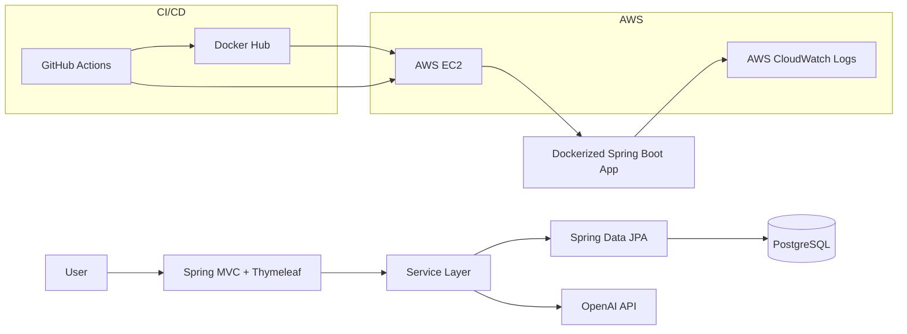

# Job Fit Analyzer

[](https://github.com/igor-romanov-solutions/job-fit-analyzer/actions/workflows/maven.yml)
[](https://github.com/igor-romanov-solutions/job-fit-analyzer/actions/workflows/deploy-ec2.yml)
[](https://sonarcloud.io/summary/new_code?id=igor-romanov-solutions_job-fit-analyzer)


Job Fit Analyzer is an AI-powered job triage platform that helps job seekers systematically review and prioritize vacancies against a candidate profile. It uses LLM-based analysis to highlight how well a role matches the target background, helping users quickly identify promising opportunities and reject weak matches early.

The project is currently delivered as a practical MVP and is actively evolving toward a more complete job-search workflow platform.

## Why this project exists

Job Fit Analyzer is built for people who approach job hunting as a structured process rather than a casual search. On large platforms like LinkedIn, job results are often repetitive, noisy, and only partially relevant, which makes it easy to miss good opportunities or spend time on unsuitable ones.

The application helps users collect vacancies in one place, enrich them with AI-generated signals, and quickly triage them into roles to reject, review later, or prioritize for application. It does not apply for jobs automatically — but it helps users make that decision faster, more consistently, and with greater confidence.

## Key features

- Create, update, view, and filter job postings
- Auto-fill job posting details from LinkedIn URLs
- Analyze job postings against a candidate profile using OpenAI
- Store job postings and analysis results in PostgreSQL
- Manage database schema evolution with Flyway migrations
- Bulk update job statuses by filter
- Server-side rendered UI with Thymeleaf and Bootstrap
- Centralized error handling with custom error pages
- Correlation ID logging for request tracing
- Spring Boot Actuator health endpoint for operational checks
- Docker and Docker Compose support for local and production-like runs
- AWS EC2 deployment with CloudWatch container log shipping
- GitHub Actions CI/CD pipeline with Maven, tests, SonarCloud, Docker image publishing, and EC2 deployment
- Unit, MVC, and application context tests

## Roadmap

### Short-term
- Add pagination for the job list
- Introduce background processing for bulk import
- Introduce background processing for bulk analysis
- Add background progress tracking and failure reporting
- Add status updates for selected jobs using checkboxes

### Mid-term
- Support retry/cancel for long-running tasks
- Improve job list sorting and filtering UX
- Compare multiple CV versions against a job posting
- Add smarter CV-to-job fit recommendations

### Long-term
- Add authentication and authorization
- Add a more flexible filter builder
- Expand job matching and recommendation logic
- Support additional job application channels beyond LinkedIn
- Improve analytics and dashboarding

## Tech stack

### Backend
- Java 21
- Spring Boot
- Spring MVC
- Spring Data JPA
- Spring Validation

### Frontend
- Thymeleaf
- Bootstrap

### Persistence
- PostgreSQL
- H2 for tests
- Flyway

### AI / Integration
- OpenAI API
- LinkedIn metadata extraction

### DevOps / Quality
- Docker
- Docker Compose
- GitHub Actions
- Docker Hub
- SonarCloud
- JaCoCo

### Cloud / Operations
- AWS EC2
- AWS CloudWatch Logs
- Spring Boot Actuator
- Correlation ID logging

### Testing
- JUnit 5
- Mockito
- MockMvc

### Build tools
- Maven
- Lombok

## Architecture highlights

This project follows a layered Spring Boot architecture with a clear separation of concerns:

- **controller** — handles HTTP requests and server-rendered UI navigation
- **service** — contains business logic, orchestration, and transaction boundaries
- **repository** — isolates persistence access through Spring Data JPA
- **domain** — models job postings, analysis results, statuses, and workflow state
- **dto** — defines request and response payloads
- **ai** — encapsulates OpenAI integration behind a dedicated client
- **config** — provides application configuration and request tracing support

### Design decisions
- Centralized exception handling with `@ControllerAdvice`
- Transactional service layer for consistency and data integrity
- Business-driven ranking for job prioritization
- AI analysis isolated from web and persistence concerns
- Metadata extraction from LinkedIn job URLs
- Correlation ID logging for request tracing

### Production-oriented practices
- Database migrations are managed with Flyway instead of relying on Hibernate schema generation
- Application health is exposed through Spring Boot Actuator
- Docker Compose health checks are used for service readiness
- AWS-specific logging is isolated in a dedicated Docker Compose override file
- GitHub Actions workflows pin third-party actions by commit SHA
- CI pipeline includes automated tests, quality analysis, and artifact publishing

### High-level architecture



## Screenshots

### Job list
Browse, filter, and triage saved job postings.


### Create job
Add a vacancy manually or auto-fill it from a LinkedIn URL.


### Analyze job
Compare a vacancy against a candidate profile and run AI analysis.


### Analysis result
Review the generated fit summary, key signals, and potential concerns.


## Run locally

### Prerequisites
- Java 21
- Maven
- PostgreSQL (optional if using Docker Compose)

### Run with Maven

```bash
./mvnw spring-boot:run
```


### Run tests
```bash
./mvnw test
```

### Build the project
```bash
./mvnw clean package
```

## Run with Docker

### Docker Hub

Published image: [igorromanovsolutions/job-fit-analyzer](https://hub.docker.com/r/igorromanovsolutions/job-fit-analyzer)

### Development

Use the development Compose file to build and run the application from source:

```bash
docker compose -f compose.dev.yml up --build
```

### Production-like local run

Use the production Compose file to run the published image with PostgreSQL:

```bash
docker compose -f compose.prod.yml up -d
```

### AWS EC2 run with CloudWatch logging

AWS-specific logging is configured through a separate Docker Compose override file:

```bash
docker compose -f compose.prod.yml -f compose.aws.yml up -d
```

This keeps the base production Compose file portable while enabling CloudWatch log shipping only in the AWS environment.

The application uses PostgreSQL and requires the OpenAI API key to be provided through environment variables.

## Configuration

### Required environment variables
- `OPENAI_API_KEY` — OpenAI API key

### Application profiles
- `dev` — local development profile
- `postgres` — PostgreSQL-backed runtime profile

### Docker Compose files
- `compose.dev.yml` — local development build from source
- `compose.prod.yml` — production-like runtime using the published Docker image
- `compose.aws.yml` — AWS-specific override for CloudWatch logging

## Deployment

The application is deployed to AWS EC2 using GitHub Actions.

The deployment workflow:

- builds and tests the application with Maven
- builds a Docker image
- publishes the image to Docker Hub
- connects to the EC2 instance over SSH
- checks out the configured deployment branch
- pulls the target Docker image
- recreates the application container to ensure the latest image is running
- sends container logs to AWS CloudWatch through the AWS Compose override

Production deployment uses:

- PostgreSQL as the persistent database
- Flyway for schema migrations
- Docker Compose for service orchestration
- Spring Boot Actuator for health checks
- AWS CloudWatch Logs for centralized container logging

## CI/CD

The project uses GitHub Actions for continuous integration and deployment.

The CI workflow includes:

- checking out the source code
- setting up Java 21
- restoring Maven dependency cache
- building the project with Maven
- running automated tests
- generating JaCoCo coverage reports
- running SonarCloud quality analysis
- uploading the built JAR artifact

The deployment workflow includes:

- building the application
- authenticating to Docker Hub
- building and publishing a Docker image
- deploying the image to AWS EC2 via SSH
- updating the checked-out deployment branch on the server
- pulling the target image on the EC2 host
- recreating the application container
- forwarding production container logs to AWS CloudWatch

## Observability

The application includes basic production-oriented observability features:

- request correlation IDs are added to logs for traceability
- Logback is used for application logging
- Spring Boot Actuator exposes health information
- Docker Compose health checks monitor container readiness
- AWS deployments ship container logs to CloudWatch Logs

## Testing

The project includes:
- service layer unit tests
- controller MVC tests
- application context test
